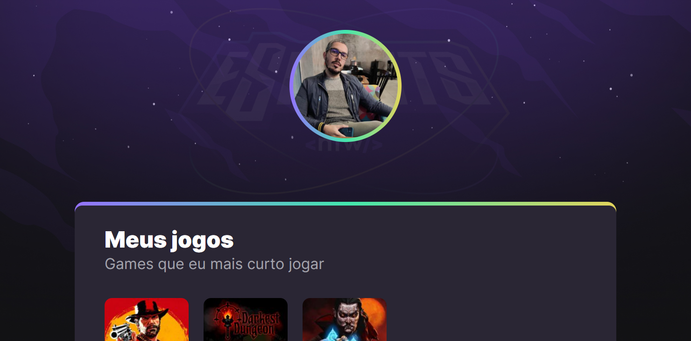

# NLW eSports - Trilha Explorer

Project built during the Next Level Week event from rocketseat.

Projeto construído no evento Next Level Week da Rocketseat.

[Click here to access / clique aqui para acessar](https://viniciusrattay.github.io/nlw-eSports-explorer/)

## Used Technologies / Tecnologias Usadas:

- HTML
- CSS
- Git and Github

## What i learned with this experience / o que aprendi:

Took my first steps into coding, i'm happy to see that i was capable of doing this level of work since this was my first ever contact with these technologies, i am looking forward to continue learning end becoming a better professional.

Foi meu primeiro contato com programação e estou bem contente com o resultado levando em consideração que foi minha primeira experiência com essas tecnologias utilizadas, quero continuar aprendendo e me aperfeiçoando para me tornar um ótimo profissional.

## Find me at / Me encontre em:

vinicius.rattay@gmail.com

https://www.linkedin.com/in/vinicius-rattay-6865a077/
